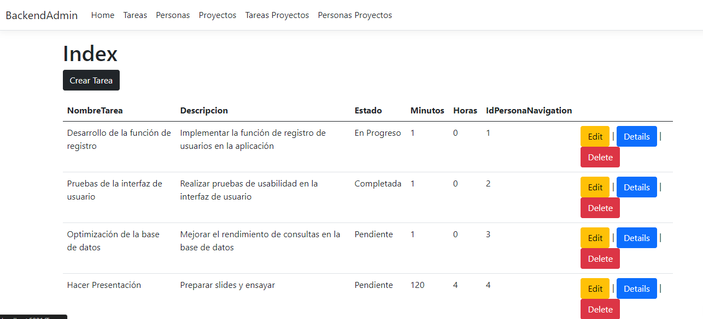
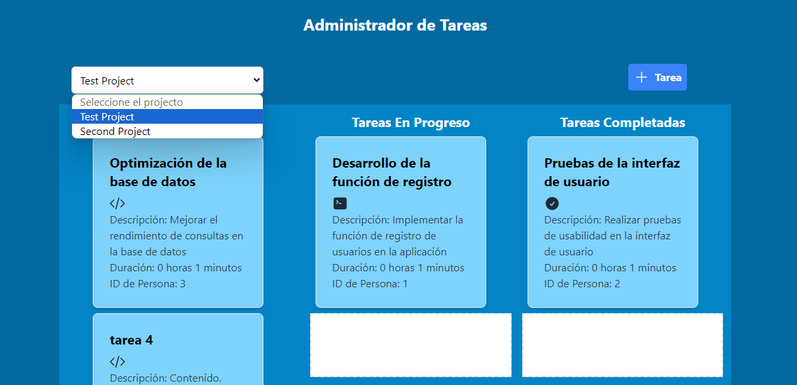
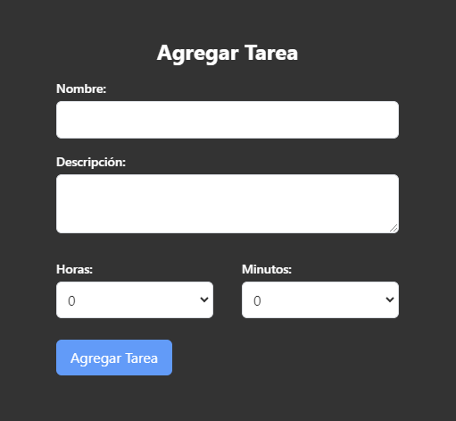
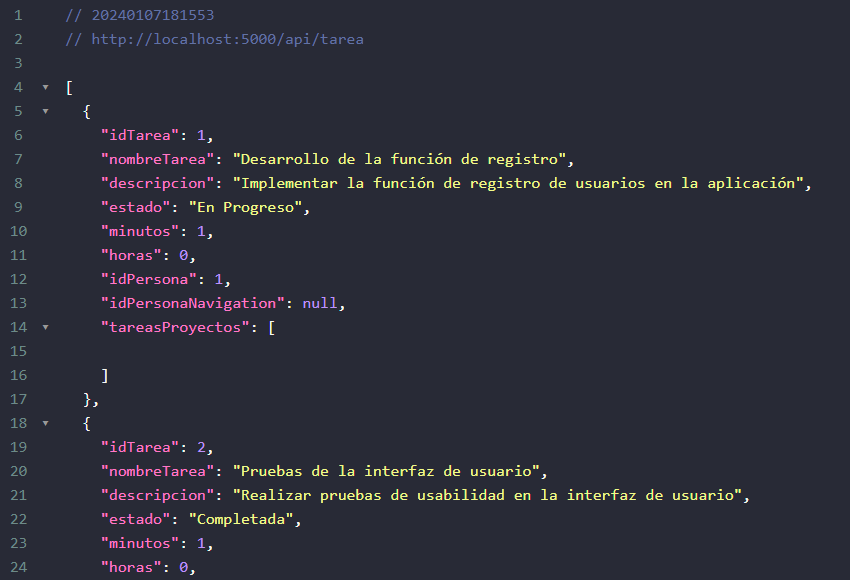
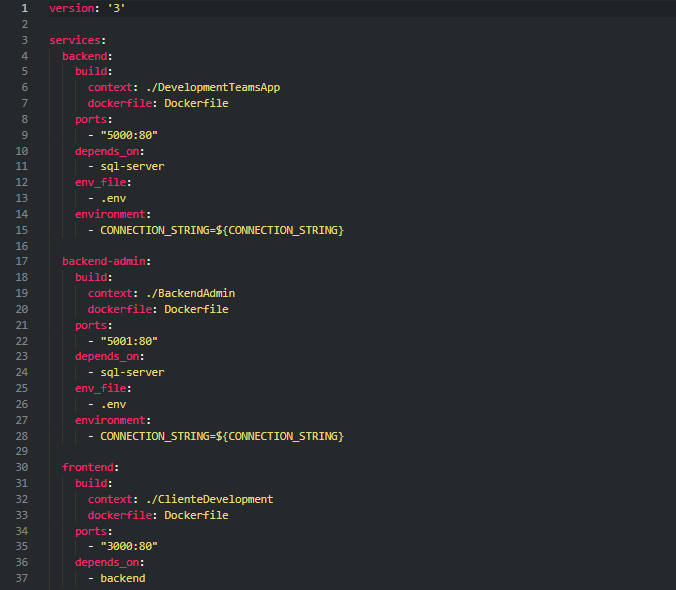

# TaskManagerApp-with-ASP.NET-Core-in-the-backend-and-React-Vite-in-the-frontend-and-Docker-Compose
This is a web application for managing developers' tasks. It has an administration presentation with a Model-View-Controller structure that allows performing CRUD operations on all tables in the SQL Server database. 

The frontend is built with React Vite, allowing users to switch between projects, create tasks, and edit tasks to change their status through a drag-and-drop function. 

It connects to the database through another backend built in ASP.NET Core. The backend, which receives requests from the React application, has a multi-layered architecture, including a data layer, business layer, and services layer

The project has four services managed through a Docker Compose file.
